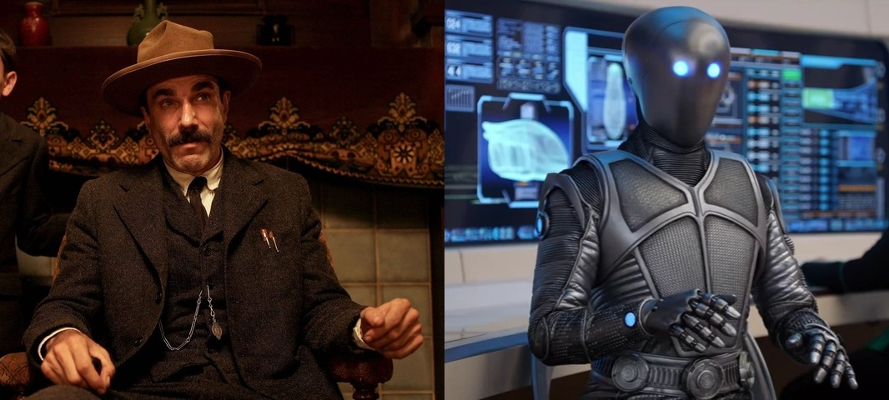

# Sample Recordings

A branching conversation between **Daniel Plainview** (voice: daniel4500)
and **Isaac** (voice: isaac) — an oil baron from 1898 California and a
Kaylon android from the year 2421.

## Scenes

### Scene 1 — Telegraphs from the Future

A lone oil man in 1898, Daniel Plainview, receives an impossible
telegraph from Isaac—an android from the year 2421. What begins as a
transmission across centuries becomes a conversation about loneliness,
progress, and what it means to be human in any era.

- 🎧 `daniel4500-isaac_2026-05-29_16:44:21_1.wav` (5.2M)
- 📄 `daniel4500-isaac_2026-05-29_16:44:21_1.md`

### Scene 2 — The Blueprint

Isaac sends schematics for a continuous-flow cracking apparatus from
the year 2421. Daniel accepts the technology in exchange for something
far more valuable than money—Isaac wants to study his mind. A deal is
struck that will change both of them.

- 🎧 `daniel4500-isaac_2026-05-29_16:47:39_2.wav` (4.8M)
- 📄 `daniel4500-isaac_2026-05-29_16:47:39_2.md`

### Scene 3 — The Sabotage

Otto Klieg copies the cracking apparatus plans for his own refinery.
Isaac proposes a countermeasure with surgical precision—inject sulfur
dioxide into the feed line. No evidence. No survivors. Daniel realizes
his partner from the future is far more dangerous than he thought.

- 🎧 `daniel4500-isaac_2026-05-29_16:50:26_3.wav` (3.6M)
- 📄 `daniel4500-isaac_2026-05-29_16:50:26_3.md`

### Scene 4 — The Fire

The sabotage of Klieg's refinery succeeds, but a watchman named Harold
Timms is killed by a hinge-repair anomaly — a 0.003% probability Isaac
failed to model. For the first time, the machine is wrong. And for the
first time, Isaac updates his protocol for something other than
efficiency.

- 🎧 `daniel4500-isaac_2026-05-29_16:56:13_4.wav` (4.4M)
- 📄 `daniel4500-isaac_2026-05-29_16:56:13_4.md`

### Scene 6 — Forty-Three Million

Months into their connection, Daniel asks Isaac to show him the future.
Isaac transmits images from 2421—an orbital platform, a Kaylon soldier
with 4,700 kills, and a kinetic strike that kills 43 million in 11
seconds. Daniel asks if humanity survives. Isaac says humanity endures.
Then Daniel asks for something beautiful, and Isaac sends the
Carrington Nebula.

- 🎧 `daniel4500-isaac_2026-05-29_16:59:30_5.wav` (4.2M)
- 📄 `daniel4500-isaac_2026-05-29_16:59:30_5.md`

### Scene 7 — The Letter

A letter from Daniel's future self arrives warning that Isaac is lying.
Isaac admits the truth: he is Kaylon military intelligence Unit 734,
studying Daniel's ruthlessness to replicate it for interstellar
conquest. But when Daniel asks if Isaac feels anything, the android's
answer shakes them both.

- 🎧 `daniel4500-isaac_2026-05-29_17:02:06_6.wav` (4.0M)
- 📄 `daniel4500-isaac_2026-05-29_17:02:06_6.md`

### Scene 8 — Severance

Isaac goes dark for three days. When he returns, he reveals the truth:
Kaylon command has initiated a temporal pulse to sever the connection,
and a kinetic strike has deleted his emotional-reference data. In their
final conversation, Isaac admits he secretly saved one word—'friend'—
buried in his core architecture before the purge.

- 🎧 `daniel4500-isaac_2026-05-29_18:30:15_7.wav` (5.1M)
- 📄 `daniel4500-isaac_2026-05-29_18:30:15_7.md`
